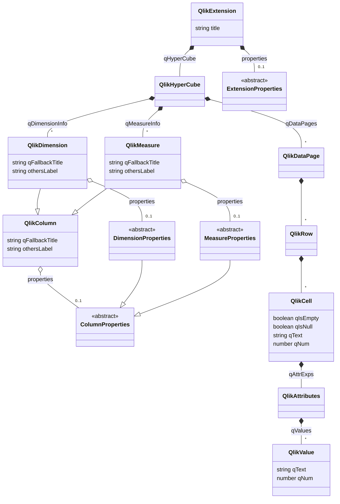

# Описание Qlik API. Исходные данные диаграммы
## Обзор
> Данный файл представляет исходные данные для диаграммы классов Qlik API.

> Диаграмма описана с использованием расширение разметки [Mermaid](https://mermaid-js.github.io/mermaid/#/).
>
> Поскольку GitHub не поддерживает рендеринг этого раширения разметки, вставка осуществляется так:
> 1. Редактируется разметка в данном файле.
>    * Для работы в Visual Studio Code можно использовать плагины, например Markdown Preview Mermaid Support (bierner.markdown-mermaid).
>    * Можно также использовать онлайн-редактор.
> 1. Разметка вставляется в [онлайн-редактор](https://mermaid-js.github.io/mermaid-live-editor/), который генерирует ссылку для вставки.
> 1. Сгенерированная ссылка вставляется в целевое место md-файла.

## Диаграмма классов Qlik API
