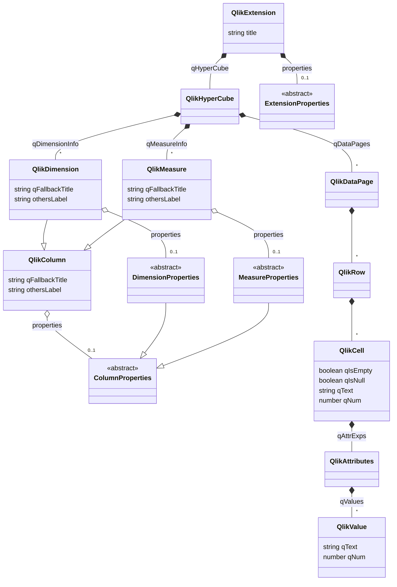

# Описание Qlik API

> Здесь представлено описание Qlik API и рекомендаций по его исользованию

## Диаграмма классов
[![](https://mermaid.ink/img/eyJjb2RlIjoiY2xhc3NEaWFncmFtXG4gICAgY2xhc3MgUWxpa0V4dGVuc2lvbiB7XG4gICAgICAgIHN0cmluZyB0aXRsZVxuICAgIH1cbiAgICBRbGlrRXh0ZW5zaW9uICotLSBRbGlrSHlwZXJDdWJlOiBxSHlwZXJDdWJlXG4gICAgUWxpa0V4dGVuc2lvbiAqLS0gXCIwLi4xXCIgRXh0ZW5zaW9uUHJvcGVydGllczogcHJvcGVydGllc1xuXG4gICAgUWxpa0h5cGVyQ3ViZSAqLS0gXCIqXCIgUWxpa0RpbWVuc2lvbjogcURpbWVuc2lvbkluZm9cbiAgICBRbGlrSHlwZXJDdWJlICotLSBcIipcIiBRbGlrTWVhc3VyZTogcU1lYXN1cmVJbmZvXG4gICAgUWxpa0h5cGVyQ3ViZSAqLS0gXCIqXCIgUWxpa0RhdGFQYWdlOiBxRGF0YVBhZ2VzXG5cbiAgICBjbGFzcyBRbGlrQ29sdW1uIHtcbiAgICAgICAgIHN0cmluZyBxRmFsbGJhY2tUaXRsZSBcbiAgICAgICAgIHN0cmluZyBvdGhlcnNMYWJlbFxuICAgIH1cbiAgICBRbGlrQ29sdW1uIG8tLSBcIjAuLjFcIiBDb2x1bW5Qcm9wZXJ0aWVzOiBwcm9wZXJ0aWVzXG5cbiAgICBjbGFzcyBRbGlrRGltZW5zaW9uIHtcbiAgICAgICAgIHN0cmluZyBxRmFsbGJhY2tUaXRsZSBcbiAgICAgICAgIHN0cmluZyBvdGhlcnNMYWJlbFxuICAgIH1cbiAgICBRbGlrRGltZW5zaW9uIC0tfD4gUWxpa0NvbHVtblxuICAgIFFsaWtEaW1lbnNpb24gby0tIFwiMC4uMVwiIERpbWVuc2lvblByb3BlcnRpZXM6IHByb3BlcnRpZXNcblxuICAgIGNsYXNzIFFsaWtNZWFzdXJlIHtcbiAgICAgICAgIHN0cmluZyBxRmFsbGJhY2tUaXRsZSBcbiAgICAgICAgIHN0cmluZyBvdGhlcnNMYWJlbFxuICAgIH1cbiAgICBRbGlrTWVhc3VyZSAtLXw-IFFsaWtDb2x1bW5cbiAgICBRbGlrTWVhc3VyZSBvLS0gXCIwLi4xXCIgTWVhc3VyZVByb3BlcnRpZXM6IHByb3BlcnRpZXNcblxuICAgIFFsaWtEYXRhUGFnZSAqLS0gXCIqXCIgUWxpa1Jvd1xuXG4gICAgUWxpa1JvdyAqLS0gXCIqXCIgUWxpa0NlbGxcblxuICAgIGNsYXNzIFFsaWtDZWxsIHtcbiAgICAgICAgYm9vbGVhbiBxSXNFbXB0eVxuICAgICAgICBib29sZWFuIHFJc051bGxcbiAgICAgICAgc3RyaW5nIHFUZXh0XG4gICAgICAgIG51bWJlciBxTnVtXG4gICAgfVxuICAgIFFsaWtDZWxsICotLSBRbGlrQXR0cmlidXRlczogcUF0dHJFeHBzXG5cbiAgICBRbGlrQXR0cmlidXRlcyAqLS0gXCIqXCIgUWxpa1ZhbHVlOiBxVmFsdWVzXG5cbiAgICBjbGFzcyBRbGlrVmFsdWUge1xuICAgICAgICBzdHJpbmcgcVRleHRcbiAgICAgICAgbnVtYmVyIHFOdW0gXG4gICAgfVxuXG4gICAgY2xhc3MgRXh0ZW5zaW9uUHJvcGVydGllcyB7XG4gICAgICAgIDw8YWJzdHJhY3Q-PlxuICAgIH1cblxuICAgIGNsYXNzIENvbHVtblByb3BlcnRpZXMge1xuICAgICAgICA8PGFic3RyYWN0Pj5cbiAgICB9XG5cbiAgICBjbGFzcyBEaW1lbnNpb25Qcm9wZXJ0aWVzIHtcbiAgICAgICAgPDxhYnN0cmFjdD4-XG4gICAgfVxuICAgIERpbWVuc2lvblByb3BlcnRpZXMgLS18PiBDb2x1bW5Qcm9wZXJ0aWVzXG5cbiAgICBjbGFzcyBNZWFzdXJlUHJvcGVydGllcyB7XG4gICAgICAgIDw8YWJzdHJhY3Q-PlxuICAgIH1cbiAgICBNZWFzdXJlUHJvcGVydGllcyAtLXw-IENvbHVtblByb3BlcnRpZXMiLCJtZXJtYWlkIjp7InRoZW1lIjoiZGVmYXVsdCJ9LCJ1cGRhdGVFZGl0b3IiOmZhbHNlfQ)](https://mermaid-js.github.io/mermaid-live-editor/#/edit/eyJjb2RlIjoiY2xhc3NEaWFncmFtXG4gICAgY2xhc3MgUWxpa0V4dGVuc2lvbiB7XG4gICAgICAgIHN0cmluZyB0aXRsZVxuICAgIH1cbiAgICBRbGlrRXh0ZW5zaW9uICotLSBRbGlrSHlwZXJDdWJlOiBxSHlwZXJDdWJlXG4gICAgUWxpa0V4dGVuc2lvbiAqLS0gXCIwLi4xXCIgRXh0ZW5zaW9uUHJvcGVydGllczogcHJvcGVydGllc1xuXG4gICAgUWxpa0h5cGVyQ3ViZSAqLS0gXCIqXCIgUWxpa0RpbWVuc2lvbjogcURpbWVuc2lvbkluZm9cbiAgICBRbGlrSHlwZXJDdWJlICotLSBcIipcIiBRbGlrTWVhc3VyZTogcU1lYXN1cmVJbmZvXG4gICAgUWxpa0h5cGVyQ3ViZSAqLS0gXCIqXCIgUWxpa0RhdGFQYWdlOiBxRGF0YVBhZ2VzXG5cbiAgICBjbGFzcyBRbGlrQ29sdW1uIHtcbiAgICAgICAgIHN0cmluZyBxRmFsbGJhY2tUaXRsZSBcbiAgICAgICAgIHN0cmluZyBvdGhlcnNMYWJlbFxuICAgIH1cbiAgICBRbGlrQ29sdW1uIG8tLSBcIjAuLjFcIiBDb2x1bW5Qcm9wZXJ0aWVzOiBwcm9wZXJ0aWVzXG5cbiAgICBjbGFzcyBRbGlrRGltZW5zaW9uIHtcbiAgICAgICAgIHN0cmluZyBxRmFsbGJhY2tUaXRsZSBcbiAgICAgICAgIHN0cmluZyBvdGhlcnNMYWJlbFxuICAgIH1cbiAgICBRbGlrRGltZW5zaW9uIC0tfD4gUWxpa0NvbHVtblxuICAgIFFsaWtEaW1lbnNpb24gby0tIFwiMC4uMVwiIERpbWVuc2lvblByb3BlcnRpZXM6IHByb3BlcnRpZXNcblxuICAgIGNsYXNzIFFsaWtNZWFzdXJlIHtcbiAgICAgICAgIHN0cmluZyBxRmFsbGJhY2tUaXRsZSBcbiAgICAgICAgIHN0cmluZyBvdGhlcnNMYWJlbFxuICAgIH1cbiAgICBRbGlrTWVhc3VyZSAtLXw-IFFsaWtDb2x1bW5cbiAgICBRbGlrTWVhc3VyZSBvLS0gXCIwLi4xXCIgTWVhc3VyZVByb3BlcnRpZXM6IHByb3BlcnRpZXNcblxuICAgIFFsaWtEYXRhUGFnZSAqLS0gXCIqXCIgUWxpa1Jvd1xuXG4gICAgUWxpa1JvdyAqLS0gXCIqXCIgUWxpa0NlbGxcblxuICAgIGNsYXNzIFFsaWtDZWxsIHtcbiAgICAgICAgYm9vbGVhbiBxSXNFbXB0eVxuICAgICAgICBib29sZWFuIHFJc051bGxcbiAgICAgICAgc3RyaW5nIHFUZXh0XG4gICAgICAgIG51bWJlciBxTnVtXG4gICAgfVxuICAgIFFsaWtDZWxsICotLSBRbGlrQXR0cmlidXRlczogcUF0dHJFeHBzXG5cbiAgICBRbGlrQXR0cmlidXRlcyAqLS0gXCIqXCIgUWxpa1ZhbHVlOiBxVmFsdWVzXG5cbiAgICBjbGFzcyBRbGlrVmFsdWUge1xuICAgICAgICBzdHJpbmcgcVRleHRcbiAgICAgICAgbnVtYmVyIHFOdW0gXG4gICAgfVxuXG4gICAgY2xhc3MgRXh0ZW5zaW9uUHJvcGVydGllcyB7XG4gICAgICAgIDw8YWJzdHJhY3Q-PlxuICAgIH1cblxuICAgIGNsYXNzIENvbHVtblByb3BlcnRpZXMge1xuICAgICAgICA8PGFic3RyYWN0Pj5cbiAgICB9XG5cbiAgICBjbGFzcyBEaW1lbnNpb25Qcm9wZXJ0aWVzIHtcbiAgICAgICAgPDxhYnN0cmFjdD4-XG4gICAgfVxuICAgIERpbWVuc2lvblByb3BlcnRpZXMgLS18PiBDb2x1bW5Qcm9wZXJ0aWVzXG5cbiAgICBjbGFzcyBNZWFzdXJlUHJvcGVydGllcyB7XG4gICAgICAgIDw8YWJzdHJhY3Q-PlxuICAgIH1cbiAgICBNZWFzdXJlUHJvcGVydGllcyAtLXw-IENvbHVtblByb3BlcnRpZXMiLCJtZXJtYWlkIjp7InRoZW1lIjoiZGVmYXVsdCJ9LCJ1cGRhdGVFZGl0b3IiOmZhbHNlfQ)

## Описание модели
В описании представлены лишь основные классы Qlik API.

Названия классов Qlik API могут не точно соответствовать указанным в официальной документации, но соответствуют определениям в `qlik.jsdoc.js`.

В описание так же присутствуют абстрактные пользовательские классы, отмечающие места для дополнения.
Рекомендуемыми точками дополнения модели являются: расширение, столбцы (меры и измерения) и ячейки.

### Дополнение свойства расширения
Иногда возникает необходимость предоставить пользователю нестандартные настройки, применяемые на уровне всего расширения.

В этом случае рекомендуется дополнять класс `QlikExtension`, представляющий расширение, полем пользовательского типа.

В данном случае это поле называется `properties` и имеет тип `ExtensionProperties`. Поле и тип не являются частью Qlik API.

### Дополнение свойства столбца
Иногда возникает необходимость дополнить измерение или меру (вместе называемые столбец) нестандартными настройками.

Измерение представляется классом `QlikDimension`, мера - `QlikMeasure`.
Измерение и мера могут быть расширены полями пользовательского типа.

В данном случае в измерение добавляется поле `properties` типа `DimensionProperties`, а в меру поле `properties` типа `MeasureProperties`. Указанные поля и типы не являются частью Qlik API.

### Дополнение свойства ячейки
Иногда возникает необходимость дополнить нестандартными настройками ячейку данных.

Ячейка представляется классом `QlikCell`.

Расширение ячеек выполняется при помощи атрибутов, при этом в поле `qAttrExps` в массиве `qValue` по определённому индексу лежит объект класса `QlikAttributes`, представляющий значение нового свойства.

---

# Исходные данные диаграммы

> Ниже представлены исходные данные для диаграммы классов Qlik API.
>
> Диаграмма описана с использованием расширение разметки [Mermaid](https://mermaid-js.github.io/mermaid/#/).
>
> Поскольку GitHub не поддерживает рендеринг этого раширения разметки, вставка осуществляется так:
> 1. Редактируется разметка в данном файле.
>    * Для работы в Visual Studio Code можно использовать плагины, например Markdown Preview Mermaid Support (bierner.markdown-mermaid).
>    * Можно также использовать онлайн-редактор.
> 1. Разметка вставляется в [онлайн-редактор](https://mermaid-js.github.io/mermaid-live-editor/), который генерирует ссылку для вставки.
> 1. Сгенерированная ссылка вставляется в раздел Диаграмма классов.

## Mermaid-разметка
