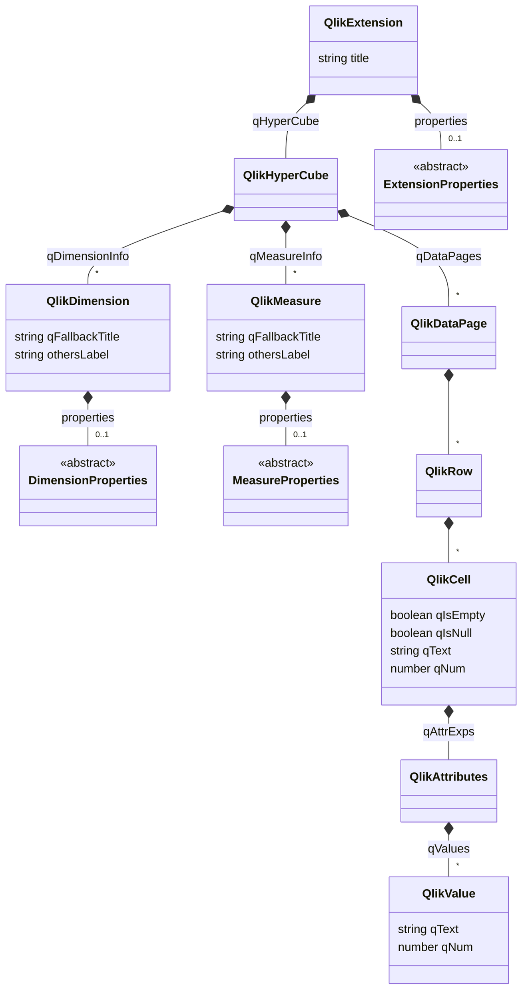

# Описание Qlik API

> Здесь представлено описание Qlik API и рекомендаций по его исользованию

## Диаграмма классов
[![](https://mermaid.ink/img/eyJjb2RlIjoiY2xhc3NEaWFncmFtXG4gICAgY2xhc3MgUWxpa0V4dGVuc2lvbiB7XG4gICAgICAgIHN0cmluZyB0aXRsZVxuICAgIH1cbiAgICBRbGlrRXh0ZW5zaW9uICotLSBRbGlrSHlwZXJDdWJlOiBxSHlwZXJDdWJlXG4gICAgUWxpa0V4dGVuc2lvbiAqLS0gXCIwLi4xXCIgRXh0ZW5zaW9uUHJvcGVydGllczogcHJvcGVydGllc1xuXG4gICAgUWxpa0h5cGVyQ3ViZSAqLS0gXCIqXCIgUWxpa0RpbWVuc2lvbjogcURpbWVuc2lvbkluZm9cbiAgICBRbGlrSHlwZXJDdWJlICotLSBcIipcIiBRbGlrTWVhc3VyZTogcU1lYXN1cmVJbmZvXG4gICAgUWxpa0h5cGVyQ3ViZSAqLS0gXCIqXCIgUWxpa0RhdGFQYWdlOiBxRGF0YVBhZ2VzXG5cbiAgICBjbGFzcyBRbGlrRGltZW5zaW9uIHtcbiAgICAgICAgIHN0cmluZyBxRmFsbGJhY2tUaXRsZSBcbiAgICAgICAgIHN0cmluZyBvdGhlcnNMYWJlbFxuICAgIH1cbiAgICBRbGlrRGltZW5zaW9uICotLSBcIjAuLjFcIiBEaW1lbnNpb25Qcm9wZXJ0aWVzOiBwcm9wZXJ0aWVzXG5cbiAgICBjbGFzcyBRbGlrTWVhc3VyZSB7XG4gICAgICAgICBzdHJpbmcgcUZhbGxiYWNrVGl0bGUgXG4gICAgICAgICBzdHJpbmcgb3RoZXJzTGFiZWxcbiAgICB9XG4gICAgUWxpa01lYXN1cmUgKi0tIFwiMC4uMVwiIE1lYXN1cmVQcm9wZXJ0aWVzOiBwcm9wZXJ0aWVzXG5cbiAgICBRbGlrRGF0YVBhZ2UgKi0tIFwiKlwiIFFsaWtSb3dcblxuICAgIFFsaWtSb3cgKi0tIFwiKlwiIFFsaWtDZWxsXG5cbiAgICBjbGFzcyBRbGlrQ2VsbCB7XG4gICAgICAgIGJvb2xlYW4gcUlzRW1wdHlcbiAgICAgICAgYm9vbGVhbiBxSXNOdWxsXG4gICAgICAgIHN0cmluZyBxVGV4dFxuICAgICAgICBudW1iZXIgcU51bVxuICAgIH1cbiAgICBRbGlrQ2VsbCAqLS0gUWxpa0F0dHJpYnV0ZXM6IHFBdHRyRXhwc1xuXG4gICAgUWxpa0F0dHJpYnV0ZXMgKi0tIFwiKlwiIFFsaWtWYWx1ZTogcVZhbHVlc1xuXG4gICAgY2xhc3MgUWxpa1ZhbHVlIHtcbiAgICAgICAgc3RyaW5nIHFUZXh0XG4gICAgICAgIG51bWJlciBxTnVtIFxuICAgIH1cblxuICAgIGNsYXNzIEV4dGVuc2lvblByb3BlcnRpZXMge1xuICAgICAgICA8PGFic3RyYWN0Pj5cbiAgICB9XG5cbiAgICBjbGFzcyBEaW1lbnNpb25Qcm9wZXJ0aWVzIHtcbiAgICAgICAgPDxhYnN0cmFjdD4-XG4gICAgfVxuXG4gICAgY2xhc3MgTWVhc3VyZVByb3BlcnRpZXMge1xuICAgICAgICA8PGFic3RyYWN0Pj5cbiAgICB9IiwibWVybWFpZCI6eyJ0aGVtZSI6ImRlZmF1bHQifSwidXBkYXRlRWRpdG9yIjpmYWxzZX0)](https://mermaid-js.github.io/mermaid-live-editor/#/edit/eyJjb2RlIjoiY2xhc3NEaWFncmFtXG4gICAgY2xhc3MgUWxpa0V4dGVuc2lvbiB7XG4gICAgICAgIHN0cmluZyB0aXRsZVxuICAgIH1cbiAgICBRbGlrRXh0ZW5zaW9uICotLSBRbGlrSHlwZXJDdWJlOiBxSHlwZXJDdWJlXG4gICAgUWxpa0V4dGVuc2lvbiAqLS0gXCIwLi4xXCIgRXh0ZW5zaW9uUHJvcGVydGllczogcHJvcGVydGllc1xuXG4gICAgUWxpa0h5cGVyQ3ViZSAqLS0gXCIqXCIgUWxpa0RpbWVuc2lvbjogcURpbWVuc2lvbkluZm9cbiAgICBRbGlrSHlwZXJDdWJlICotLSBcIipcIiBRbGlrTWVhc3VyZTogcU1lYXN1cmVJbmZvXG4gICAgUWxpa0h5cGVyQ3ViZSAqLS0gXCIqXCIgUWxpa0RhdGFQYWdlOiBxRGF0YVBhZ2VzXG5cbiAgICBjbGFzcyBRbGlrRGltZW5zaW9uIHtcbiAgICAgICAgIHN0cmluZyBxRmFsbGJhY2tUaXRsZSBcbiAgICAgICAgIHN0cmluZyBvdGhlcnNMYWJlbFxuICAgIH1cbiAgICBRbGlrRGltZW5zaW9uICotLSBcIjAuLjFcIiBEaW1lbnNpb25Qcm9wZXJ0aWVzOiBwcm9wZXJ0aWVzXG5cbiAgICBjbGFzcyBRbGlrTWVhc3VyZSB7XG4gICAgICAgICBzdHJpbmcgcUZhbGxiYWNrVGl0bGUgXG4gICAgICAgICBzdHJpbmcgb3RoZXJzTGFiZWxcbiAgICB9XG4gICAgUWxpa01lYXN1cmUgKi0tIFwiMC4uMVwiIE1lYXN1cmVQcm9wZXJ0aWVzOiBwcm9wZXJ0aWVzXG5cbiAgICBRbGlrRGF0YVBhZ2UgKi0tIFwiKlwiIFFsaWtSb3dcblxuICAgIFFsaWtSb3cgKi0tIFwiKlwiIFFsaWtDZWxsXG5cbiAgICBjbGFzcyBRbGlrQ2VsbCB7XG4gICAgICAgIGJvb2xlYW4gcUlzRW1wdHlcbiAgICAgICAgYm9vbGVhbiBxSXNOdWxsXG4gICAgICAgIHN0cmluZyBxVGV4dFxuICAgICAgICBudW1iZXIgcU51bVxuICAgIH1cbiAgICBRbGlrQ2VsbCAqLS0gUWxpa0F0dHJpYnV0ZXM6IHFBdHRyRXhwc1xuXG4gICAgUWxpa0F0dHJpYnV0ZXMgKi0tIFwiKlwiIFFsaWtWYWx1ZTogcVZhbHVlc1xuXG4gICAgY2xhc3MgUWxpa1ZhbHVlIHtcbiAgICAgICAgc3RyaW5nIHFUZXh0XG4gICAgICAgIG51bWJlciBxTnVtIFxuICAgIH1cblxuICAgIGNsYXNzIEV4dGVuc2lvblByb3BlcnRpZXMge1xuICAgICAgICA8PGFic3RyYWN0Pj5cbiAgICB9XG5cbiAgICBjbGFzcyBEaW1lbnNpb25Qcm9wZXJ0aWVzIHtcbiAgICAgICAgPDxhYnN0cmFjdD4-XG4gICAgfVxuXG4gICAgY2xhc3MgTWVhc3VyZVByb3BlcnRpZXMge1xuICAgICAgICA8PGFic3RyYWN0Pj5cbiAgICB9IiwibWVybWFpZCI6eyJ0aGVtZSI6ImRlZmF1bHQifSwidXBkYXRlRWRpdG9yIjpmYWxzZX0)

## Описание модели
В описании представлены лишь основные типы [Qlik API](https://help.qlik.com/en-US/sense-developer/February2020/Subsystems/APIs/Content/Sense_ClientAPIs/CapabilityAPIs/qlik-interface-interface.htm).

Названия типов Qlik API адаптированы и  не точно соответствуют указанным в официальной документации.

В описание так же присутствуют абстрактные пользовательские типы, отмечающие места для дополнения.
Рекомендуемыми точками дополнения модели являются: расширение, столбцы (меры и измерения) и ячейки.

### Дополнение свойства расширения
Иногда возникает необходимость предоставить пользователю нестандартные настройки, применяемые на уровне всего расширения.

Для этого в определении пользовательского поля указывается идентификатор (в поле `ref`) равный названию целевого поля.

В объекте `QlikExtension` появится поле с указанным названием.

В данном случае все пользовательские поля сгруппированы в  объект `properties`, имеющий тип `ExtensionProperties`.

#### Пример
Определение пользовательского поля уровня расширения:
```javascript
{
    type: 'items',
    component: 'accordion',
    items: {
        // Пользовательская секция
        chart: {
            type: 'items',
            component: 'expandable-items',
            label: 'Настройки уровня расширения',
            items: {
                // Пользовательское поле
                customField: {
                    ref: 'properties.customField',
                    type: 'string',
                    label: 'Пользовательское поле'
                }
            }
        }
    }
```
Получение значения:
```javascript
paint: function($element, qlikExtension) {
    console.log(qlikExtension.properties.customField);
}
```


### Дополнение свойства столбца
Иногда возникает необходимость дополнить измерение или меру (вместе называемые столбцами) нестандартными настройками.

Для этого в секции (подключающей стандартные свойства через поле `uses`) `dimensions` для измерения или `measures` для меры в определении пользовательского поля указывается идентификатор (в поле `ref`) равный `qDef.` плюс название поля.

В объекте `QlikDimension` для меры или в объекте `QlikMeasure` для меры появится поле с указанным названием.

В данном случае все пользовательские поля сгруппированы в  объект `properties`, имеющий тип `DimensionProperties` для измерения и  `MeasureProperties` для меры.

#### Пример
Определение пользовательского поля уровня измерения:
```javascript
{
    type: 'items',
    component: 'accordion',
    items: {
        // Блок свойств измерений
        dimensions: {
            uses: 'dimensions',
            // Пользовательские свойства измерений
            items: {
                // Пользовательское поле
                customField: {
                    ref: 'properties.customField',
                    type: 'string',
                    label: 'Пользовательское поле'
                }
            }
        }
    }
}
```
Получение значения:
```javascript
paint: function($element, qlikExtension) {
    var qlikDimension = qlikExtension.qHyperCube.qDimensionInfo[0];
    console.log(qlikDimension.properties.customField);
}
```

### Дополнение свойства ячейки
Иногда возникает необходимость дополнить нестандартными настройками ячейку данных.

Для этого в секции `dimensions` или `measures` в пользовательском поле указывается идентификатор (в поле `ref`) равный конкатенации `qAttributeExpressions`, индекса свойства и `.qExpression`.

Для ячейки `QlikCell` в поле `qAttrExps` в массиве `qValues` по указанному индексу появится объект типа `QlikAttributes`, представляющий значение нового свойства.

Определение пользовательского поля уровня расширения:
```javascript
{
    type: 'items',
    component: 'accordion',
    items: {
        // Блок свойств мер
        dimensions: {
            uses: 'measures',
            // Пользовательские свойства мер
            items: {
                // Пользовательское поле
                customField: {
                    ref: 'qAttributeExpressions.0.qExpression', // 0 - ключевая часть
                    type: 'string',
                    component: 'expression',
                    expression: 'always',
                    label: 'Пользовательское поле'
                }
            }
        }
    }
}
```
Получение значения:
```javascript
paint: function($element, qlikExtension) {
    var qlikCell = qlikExtension.qHyperCube.qDataPages[0].qMatrix[0][0];
    
    // 0 - ключевая часть
    console.log(qlikCell.qAttrExps.qValues[0]);
}
```
---

# Исходные данные диаграммы

> Ниже представлены исходные данные для диаграммы классов Qlik API.
>
> Диаграмма описана с использованием расширение разметки [Mermaid](https://mermaid-js.github.io/mermaid/#/).
>

## Процесс изменения

Поскольку GitHub не поддерживает рендеринг этого раширения разметки, редактирование осуществляется так:
1. Редактируется разметка в данном файле.
   * Для работы в Visual Studio Code можно использовать плагины, например Markdown Preview Mermaid Support (`bierner.markdown-mermaid`).
   * Можно также использовать онлайн-редактор.
1. Разметка вставляется в [онлайн-редактор](https://mermaid-js.github.io/mermaid-live-editor/), который генерирует ссылку для вставки.
1. Сгенерированная ссылка вставляется в раздел Диаграмма классов этой страницы.

## Mermaid-разметка
